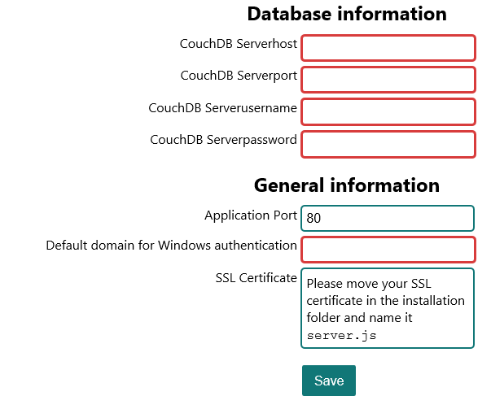

# Installation
## Requirements
- [node.js](http://nodejs.org/) >= Version v0.10.29
- npm >= Version 1.4.14
- [CouchDB](http://couchdb.apache.org/) >= Version 1.6.1
- [Git](http://git-scm.org/) >= Version 1.8.1
- [.net Framework](http://www.microsoft.com/en-us/download/details.aspx?id=30653) >= Version 4.5

## How to install
### Windows
To install serpentes, you just need to download the most recent version of the [`install-serpentes.bat`](https://github.com/CodingLizards/serpentes/releases). Execute it and it will lead you through the setup.

### Linux and OS X
At the moment, there are no instructions for OS X and Linux.
But you can probably use the same batch file like for Windows. Just the requirements might change and I don't know, if the Windows authentication part will work with mono

## How to configure
When you start the setup, a page will open, which asks you for
- CouchDB hostname
- CouchDB port
- CouchDB username
- CouchDB password
- Application port
- Default domain for Windows authentication
- SSL certificate

#### CouchDB hostname
The CouchDB hostname is the host where your CouchDB instance runs on
#### CouchDB port
The CouchDB port is the port of your CouchDB instance, default is 5984
#### CouchDB username
The CouchDB username is the username which Serpentes should use to authenticate with
#### CouchDB password
The CouchDB password is the password which Serpentes should use to authenticate with

#### Application port
The application port is the port, Serpentes will listen on
#### SSL certificate
This is the certificate, which is used for https, you need to copy it in the installation folder of your serpentes instance

When you are ready, you can click `Save` and a file, called `start.bat` will be created.
